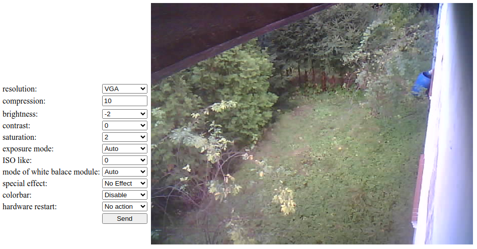

# ESP32-streaming-by-MQTT-to-webserver v0.2
Video streaming from ESP32-CAM to own webserver (for example VPS) using MQTT protocol with SSL. Complete solution.

## Things you need:
1. ESP32-CAM module & ESP32-CAM-MB USB Programmer, for example [this](https://sklep.msalamon.pl/produkt/plytka-esp32-z-kamera-esp32-cam-wifi-ble-4-2-dedykowany-programator/) or [this](https://www.amazon.de/s?k=Aideepen+ESP32-CAM+W-BT+Board+ESP32-CAM-MB+Micro+USB+to+Serial+Port+CH-340G+with+OV2640+2MP+Camera+Module+Dual+Mode+Support+NodeMCU)
2. A computer with Visual Studio Code & Platform.io installed
3. USB (computer) <-> MicroUSB (programer) cable
4. Acess to WiFi (for ESP32-CAM).
5. To the limited tests you can use [Free Public MQTT Broker](https://www.emqx.com/en/mqtt/public-mqtt5-broker). Your own broker is better option.
6. Webpanel on own hosting. Your hosting have to have instaled Mosquitto MQTT Messaging Broker. Needed script you can find in "Server scripts" section. It's possible I will make public open web panel for your tests in the future.

Own webserver (for example VPS) is very convinient option. I'm using LEMP stack on Oracle Cloud Free Tier. In my case: Debian 11.9, nginx 1.18 and PHP 7.4.33 (FastCGI).

---

### Broker MQTT

Firstly could you have to have **MQTT** broker.

#### EMQX Free Public MQTT Broker option

You can use [Free Public MQTT Broker](https://www.emqx.com/en/mqtt/public-mqtt5-broker).
Create account, free plan Serverless offer free quota every month:
* 1 million session minutes (for connection)
* 1 GB (for traffic)
* 1 million rule actions (for Data Integration)

Quota for traffic is very small for us (we will send images over MQTT). It sufficient only for any tests.

Data of broker (to set in main.cpp):
(Overview->Adress)
const char* mqttServer = "kf381832.ala.eu-central-1.emqxsl.com";
(Overview->MQTT over TLS/SSL Port)
const long mqttPort = 8883;
(Access control->Autentification->Add)
const char* mqttUser = "your_username";
const char* mqttPass = "your_password";
(Overview->CA Certificate:)
const char* emqx_ca= emqxsl-ca.crt
You have manual copy each line of emqxsl-ca.crt to format "gt8TAQEBMA0GCSqGSIb3DQEBCwUAA4ICAQCFyk5HPqP3hUSFvNVneLKYY611TR6W\n" \ ("line_of_certificate" /)

#### Own MQTT broker option

If you prefere you can prepare your own MQTT broker. I'am using Mosquitto MQTT Messaging Broker. Two good manuals:
* [How to Install and Secure the Mosquitto MQTT Messaging Broker on Debian 10](https://www.digitalocean.com/community/tutorials/how-to-install-and-secure-the-mosquitto-mqtt-messaging-broker-on-debian-10)
* [How to Install Mosquitto MQTT Message Broker on Debian 11](https://www.howtoforge.com/how-to-install-mosquitto-mqtt-message-broker-on-debian-11/)
In my case it is Debian 11.9 version & PHP 7.4. Mosquitto-PHP does'n work good in higher version PHP I mean.

---

### ESP32 side

You can use file [/esp32cam/src/main.cpp](https://github.com/Szern/ESP32-streaming-by-MQTT-to-webserver/blob/main/esp32cam/src/main.cpp). This is file for Platform.io. You can use this file [/esp32cam/platformio.ini](https://github.com/Szern/ESP32-streaming-by-MQTT-to-webserver/blob/main/esp32cam/platformio.ini) for VSC.

You have to change a few this lines:

```C
// configuration start

const char* ssid = "your_WiFi_network_name"; // Replace with your network name
const char* password = "password_to_your_WiFi_network_name"; // Replace with your password to WiFi

static const char* url = "https://www.yourdomain.eu/cam/firmware.bin";

const char* ntpServer = "ntp1.tp.pl";
const long gmtOffset_sec = 3600;   // GMT offset (seconds)
const int daylightOffset_sec = 3600;  // daylight offset (seconds)

const char* mqttServer = "www.yourdomain.eu"; // Replace with your webserver adress or webserver IP
const long mqttPortS = 8883;
const long mqttPortU = 8884;
const char* mqttUser = "mosquitto"; // Replace with your MQTT broker user name
const char* mqttPass = "mosquitto"; // Replace with your MQTT broker users password
const char* mqttId = "esp32-cam";
const char* mqttTopicOut = "cam/out"; // Replace with your webserver topic name to send images from camera to server
const char* mqttTopicIn = "cam/in"; // Replace with your webserver topic name to send instructions from server to camera
const char* mqttTopicDebug = "cam/debug";
const char * mqtt_time = "time";
const char * mqtt_knock = "knock, knock";
const char * mqtt_memory = "memory";
const char * mqtt_signal = "signal";
const char * mqtt_echo = "echo";
const char * mqtt_ota = "runOTA";
const char * key1 = "settings"; // a place in flash memory
const char * key2 = "security"; // a place in flash memory
int security = 1;

// chain.pem
static const char * host_ca = "-----BEGIN CERTIFICATE-----\n"
"MIIFBjCCAu6gAwIBAgIRAIp9PhPWLzDvI4a9KQdrNPgwDQYJKoZIhvcNAQELBQAw\n"
"TzELMAkGA1UEBhMCVVMxKTAnBgNVBAoTIEludGVybmV0IFNlY3VyaXR5IFJlc2Vh\n"
"cmNoIEdyb3VwMRUwEwYDVQQDEwxJU1JHIFJvb3QgWDEwHhcNMjQwMzEzMDAwMDAw\n"
"WhcNMjcwMzEyMjM1OTU5WjAzMQswCQYDVQQGEwJVUzEWMBQGA1UEChMNTGV0J3Mg\n"
"RW5jcnlwdDEMMAoGA1UEAxMDUjExMIIBIjANBgkqhkiG9w0BAQEFAAOCAQ8AMIIB\n"
"CgKCAQEAuoe8XBsAOcvKCs3UZxD5ATylTqVhyybKUvsVAbe5KPUoHu0nsyQYOWcJ\n"
"DAjs4DqwO3cOvfPlOVRBDE6uQdaZdN5R2+97/1i9qLcT9t4x1fJyyXJqC4N0lZxG\n"
"AGQUmfOx2SLZzaiSqhwmej/+71gFewiVgdtxD4774zEJuwm+UE1fj5F2PVqdnoPy\n"
"6cRms+EGZkNIGIBloDcYmpuEMpexsr3E+BUAnSeI++JjF5ZsmydnS8TbKF5pwnnw\n"
"SVzgJFDhxLyhBax7QG0AtMJBP6dYuC/FXJuluwme8f7rsIU5/agK70XEeOtlKsLP\n"
"Xzze41xNG/cLJyuqC0J3U095ah2H2QIDAQABo4H4MIH1MA4GA1UdDwEB/wQEAwIB\n"
"hjAdBgNVHSUEFjAUBggrBgEFBQcDAgYIKwYBBQUHAwEwEgYDVR0TAQH/BAgwBgEB\n"
"/wIBADAdBgNVHQ4EFgQUxc9GpOr0w8B6bJXELbBeki8m47kwHwYDVR0jBBgwFoAU\n"
"ebRZ5nu25eQBc4AIiMgaWPbpm24wMgYIKwYBBQUHAQEEJjAkMCIGCCsGAQUFBzAC\n"
"hhZodHRwOi8veDEuaS5sZW5jci5vcmcvMBMGA1UdIAQMMAowCAYGZ4EMAQIBMCcG\n"
"A1UdHwQgMB4wHKAaoBiGFmh0dHA6Ly94MS5jLmxlbmNyLm9yZy8wDQYJKoZIhvcN\n"
"AQELBQADggIBAE7iiV0KAxyQOND1H/lxXPjDj7I3iHpvsCUf7b632IYGjukJhM1y\n"
"v4Hz/MrPU0jtvfZpQtSlET41yBOykh0FX+ou1Nj4ScOt9ZmWnO8m2OG0JAtIIE38\n"
"01S0qcYhyOE2G/93ZCkXufBL713qzXnQv5C/viOykNpKqUgxdKlEC+Hi9i2DcaR1\n"
"e9KUwQUZRhy5j/PEdEglKg3l9dtD4tuTm7kZtB8v32oOjzHTYw+7KdzdZiw/sBtn\n"
"UfhBPORNuay4pJxmY/WrhSMdzFO2q3Gu3MUBcdo27goYKjL9CTF8j/Zz55yctUoV\n"
"aneCWs/ajUX+HypkBTA+c8LGDLnWO2NKq0YD/pnARkAnYGPfUDoHR9gVSp/qRx+Z\n"
"WghiDLZsMwhN1zjtSC0uBWiugF3vTNzYIEFfaPG7Ws3jDrAMMYebQ95JQ+HIBD/R\n"
"PBuHRTBpqKlyDnkSHDHYPiNX3adPoPAcgdF3H2/W0rmoswMWgTlLn1Wu0mrks7/q\n"
"pdWfS6PJ1jty80r2VKsM/Dj3YIDfbjXKdaFU5C+8bhfJGqU3taKauuz0wHVGT3eo\n"
"6FlWkWYtbt4pgdamlwVeZEW+LM7qZEJEsMNPrfC03APKmZsJgpWCDWOKZvkZcvjV\n"
"uYkQ4omYCTX5ohy+knMjdOmdH9c7SpqEWBDC86fiNex+O0XOMEZSa8DA\n"
"-----END CERTIFICATE-----\n";

// configuration end
```

After making this changes you should upload compiled file to ESP32-CAM.

*If you want to use ArduinoIDE, you have to install [MQTTPubSubClient library](https://github.com/hideakitai/MQTTPubSubClient).*

---

### Server scripts 

Next you need **MQTT client**.

You have to prepare your own MQTT client. You can install MQTT client for PHP (exactly FastCGI wrapper). I'm using [Mosquitto-PHP](https://github.com/mgdm/Mosquitto-PHP)
On server we will build web interface. In nginx you have to configure domain (or subdomain). SSL certyficate (for example free Certbot) is recomended.

One file you need is [/webserver/webcam.php](https://github.com/Szern/ESP32-streaming-by-MQTT-to-webserver/blob/main/webserver/webcam.php).
You have to change three line:

```php
$username = "mosquitto"; // Replace with your MQTT broker user name
$password = "mosquitto"; // Replace with your MQTT broker users password
...
$topic = "cam1/out"; // Replace with your webserver topic name to send images from camera to server
```
and second file: [/webserver/stream.php](https://github.com/Szern/ESP32-streaming-by-MQTT-to-webserver/blob/main/webserver/stream.php)
where you have to change the follow lines:

```php
$cam_data = '/home/www/asm/res_kam' . $camera . '.txt'; // Replace path of your file location on the server
...
$username = "mosquitto"; // Replace with your MQTT broker user name
$password = "mosquitto"; // Replace with your MQTT broker users password
...
$topic = "cam" . $camera . "/in"; // Replace with your webserver topic name to send instructions from server to camera
```

You can have one file stream.php and a lot files: webcam1.php, webcam2.php, webcam3.php...

---

Now you can start connection between ESP32-CAM, MQTT broker and webserver.



That's all folks. You can connect power supply to ESP32-CAM and go to the browser (changing your domain or subdomain address): `https://www.yourdomain.com/stream.php`
